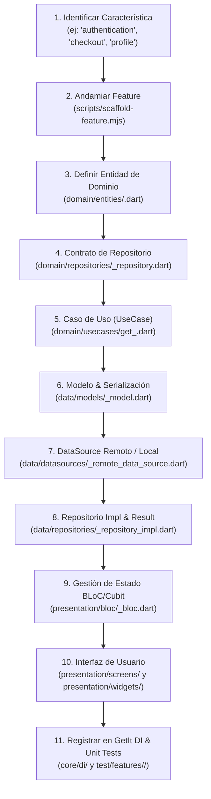

# 🏛️ Flutter Feature-First Clean Architecture Standard

## 🎯 Propósito

Estandarizar el diseño, la modularización y la construcción de aplicaciones Flutter escalables bajo el patrón de **Feature-First Clean Architecture** (segmentación vertical por características de negocio) combinado con **BLoC / Cubit** para la gestión reactiva de estado, **GetIt / Injectable** para Inversión de Dependencias (DI), y tipos funcionales sellados **`Result<Success, Failure>`** de Dart 3 para erradicar fallos no controlados en tiempo de ejecución.

Garantiza que el dominio de negocio (`domain`) permanezca completamente puro, libre de dependencias de Flutter y de detalles de infraestructura (`data`), mientras que la capa visual (`presentation`) reacciona a estados inmutables sin lógica de negocio incrustada.

---

## ⚡ Cuándo Activar esta Skill

- Al crear una nueva feature o módulo de negocio dentro de `lib/features/<feature>/`.
- Al refactorizar código monolítico o desestructurado hacia Clean Architecture en Flutter.
- Al implementar casos de uso (`usecases`), contratos de repositorio (`domain/repositories/`) o entidades puras (`domain/entities/`).
- Al diseñar orígenes de datos (`datasources`), modelos DTO (`data/models/`) o implementaciones de repositorio (`data/repositories/`).
- Al construir controladores de estado con `flutter_bloc` (`Bloc` o `Cubit`), eventos y estados inmutables.
- Al configurar el registro de dependencias con `GetIt` / `Injectable` (`core/di/injection_container.dart`).
- Al escribir pruebas unitarias con `mocktail` y `bloc_test` en `test/features/<feature>/`.

---

## 📋 Flujo de Trabajo Paso a Paso



### Secuencia Obligatoria de Construcción por Feature

Al crear una feature `<feature>` con un modelo/entidad central `<entity>`, generar y configurar los archivos en este orden estricto:

1. **Entidad de Dominio (`domain/entities/<entity>.dart`)**:
   - Clase inmutable con campos `final` o anotada con `Equatable`.
   - Libre de dependencias externas o de Flutter (Dart puro).
2. **Contrato de Repositorio (`domain/repositories/<entity>_repository.dart`)**:
   - Clase abstracta pura (`abstract interface class`).
   - Todos sus métodos retornan `Future<Result<T, Failure>>` o `Stream<Result<T, Failure>>`.
3. **Casos de Uso (`domain/usecases/<action>_<entity>.dart`)**:
   - Clase con método `call()` que implementa una única regla de negocio.
   - Depende exclusivamente de interfaces de repositorio del dominio.
4. **Modelo de Datos (`data/models/<entity>_model.dart`)**:
   - Extiende de la entidad de dominio (`class <Entity>Model extends <Entity>`).
   - Implementa serialización: `fromJson(Map<String, dynamic> json)` y `toJson()`.
5. **Data Source (`data/datasources/<entity>_remote_data_source.dart`)**:
   - Contrato abstracto y clase de implementación que interactúa con HTTP (Dio/Http), Firebase, GraphQL o bases de datos locales (Drift/Hive/Isar).
   - Lanza excepciones de infraestructura (`ServerException`, `CacheException`) que serán capturadas únicamente por la implementación del repositorio.
6. **Implementación de Repositorio (`data/repositories/<entity>_repository_impl.dart`)**:
   - Implementa la interfaz del dominio (`implements <Entity>Repository`).
   - Captura excepciones del DataSource y las transforma en instancias de `Failure` dentro de `Result.failure(failure)`.
7. **Controlador de Estado BLoC/Cubit (`presentation/bloc/`)**:
   - `state.dart`: Clase sellada con estados inmutables (`Initial`, `Loading`, `Success`, `Error`).
   - `event.dart` (en BLoC): Eventos declarativos para cada interacción del usuario.
   - `bloc.dart`: Orquesta los casos de uso y emite estados.
8. **UI Presentation (`presentation/screens/` y `widgets/`)**:
   - `Screen`: Consume el BLoC mediante `BlocProvider`, `BlocBuilder` o `BlocConsumer`.
   - `Widgets`: Componentes reutilizables y atómicos desacoplados.
9. **Inyección de Dependencias (`core/di/injection_container.dart`)**:
   - Registrar DataSource (`LazySingleton`), Repositorio (`LazySingleton`), Casos de Uso (`LazySingleton`) y BLoC (`Factory`).
10. **Pruebas Unitarias (`test/features/<feature>/`)**:
    - Mockear dependencias con `mocktail` (`class Mock<Entity>Repository extends Mock implements <Entity>Repository {}`).
    - Probar emisión secuencial de estados con `bloc_test`.

---

## 🏗️ Estructura Canónica de Directorios

```
lib/
├── core/
│   ├── constants/            # Constantes globales, colores y endpoints
│   ├── di/                   # Inyección de dependencias (injection_container.dart)
│   ├── error/                # Fallos (failures.dart) y excepciones (exceptions.dart)
│   ├── network/              # Cliente HTTP (dio_client.dart), interceptores
│   ├── theme/                # ThemeData, estilos de tipografía
│   ├── utils/                # Result sealed class (result.dart), usecase interface
│   └── widgets/              # Widgets globales compartidos (AppButton, LoadingIndicator)
├── features/
│   └── <feature_name>/       # Vertical slice (ej. authentication, catalog, checkout)
│       ├── data/
│       │   ├── datasources/  # <feature>_remote_data_source.dart, local_data_source.dart
│       │   ├── models/       # <feature>_model.dart (extiende de Entity + JSON)
│       │   └── repositories/ # <feature>_repository_impl.dart
│       ├── domain/
│       │   ├── entities/     # <feature>.dart (entidad pura de negocio)
│       │   ├── repositories/ # <feature>_repository.dart (contrato de interfaz)
│       │   └── usecases/     # get_<feature>.dart, create_<feature>.dart
│       └── presentation/
│           ├── bloc/         # <feature>_bloc.dart, <feature>_event.dart, <feature>_state.dart
│           ├── screens/      # <feature>_screen.dart (punto de entrada visual)
│           └── widgets/      # Sub-widgets encapsulados de la pantalla
└── main.dart                 # Inicialización de GetIt y runApp
```

---

## ⚠️ Reglas Críticas

1. **Regla de Dependencia Unidireccional**:
   - `domain` **NUNCA** debe importar código de `data` ni de `presentation`.
   - `domain` es Dart puro: **PROHIBIDO** importar `package:flutter/material.dart` o paquetes de persistencia en `domain/`.
   - `presentation` interactúa con el dominio únicamente a través de **Casos de Uso** (Use Cases) o el BLoC. **PROHIBIDO** inyectar DataSources o Repositorios directamente en Widgets.
2. **Uso Obligatorio del Patrón Result / Either**:
   - Los contratos de repositorios y use cases **NUNCA** deben permitir que excepciones no controladas escalen a la capa visual.
   - Las excepciones se atrapan en `data/repositories/*` y se envuelven en un `Result.failure(Failure(...))`.
3. **Inmutabilidad Absoluta en BLoC / Cubit**:
   - Todos los estados y eventos deben ser clases inmutables con campos `final` y extender de `Equatable` o usar Dart 3 `sealed class`.
   - Nunca mutar colecciones in-place: emitir siempre copias nuevas (`List.of(state.items)..add(...)` o `copyWith`).
4. **Registro de Dependencias en GetIt**:
   - DataSources, Repositorios y UseCases deben registrarse como `registerLazySingleton`.
   - Los BLoCs / Cubits deben registrarse como `registerFactory` para garantizar instancias limpias por pantalla si no son globales.
5. **Estructura de Tests Espejo**:
   - Cada archivo en `lib/features/<feature>/` con lógica evaluable debe tener su archivo correspondiente en `test/features/<feature>/`.
   - Usar `mocktail` en lugar de `mockito` para evitar pasos de `build_runner` lentos e innecesarios.

---

## 🛠️ Scripts y Herramientas Auxiliares

### CLI Scaffolder: `scaffold-feature.mjs`

La skill incluye un generador CLI determinista para andamiar una feature completa lista para producción en segundos:

```bash
# Andamiar una feature completa con BLoC, Domain, Data y Tests:
node skills/architecture/flutter-architecture/scripts/scaffold-feature.mjs auth --model user

# Andamiar usando Cubit en lugar de BLoC tradicional:
node skills/architecture/flutter-architecture/scripts/scaffold-feature.mjs cart --model cart_item --cubit

# Modo simulación sin escribir archivos (Dry Run):
node skills/architecture/flutter-architecture/scripts/scaffold-feature.mjs billing --model invoice --dry-run
```

---

## 📚 Referencias Adicionales

- [Feature-First Clean Architecture](references/feature-first-clean-architecture.md): Anatomía detallada de capas y límites.
- [BLoC & State Management](references/bloc-and-state-management.md): Convenciones de estados, eventos y `bloc_test`.
- [Result Pattern & Error Handling](references/result-pattern-and-error-handling.md): Clase sellada `Result` de Dart 3 y `Failure`.
- [Dependency Injection with GetIt](references/dependency-injection-get-it.md): Patrones de registro y ciclo de vida de dependencias.
