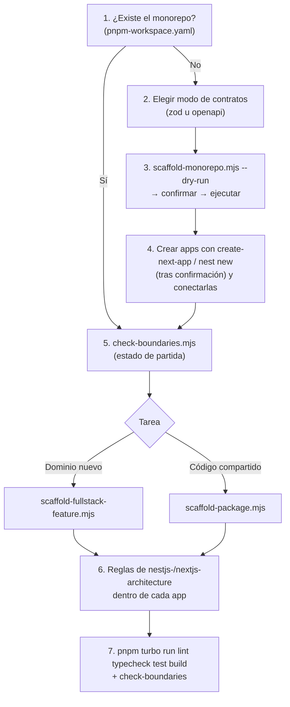

# 🗂️ Monorepo Architecture Standard (pnpm + Turborepo)

## 🎯 Propósito

Estandarizar monorepos que alojan una **web Next.js** y una **API NestJS** junto con paquetes internos compartidos. Define la estructura raíz (`apps/`, `packages/`), el pipeline de tareas con Turborepo, cómo se construyen y consumen los paquetes internos, cómo se comparten contratos entre web y API, y qué puede importar qué, verificado con un script.

Las reglas **internas** de cada app no cambian: `apps/web` sigue [`nextjs-architecture`](../nextjs-architecture/SKILL.md) y `apps/api` sigue [`nestjs-architecture`](../nestjs-architecture/SKILL.md). Esta skill solo gobierna lo que hay entre ellas.

---

## ⚡ Cuándo Activar esta Skill

- Al crear un monorepo nuevo o reorganizar un repositorio con varias apps y paquetes.
- Al crear un paquete interno compartido (`packages/<name>`).
- Al añadir un dominio de punta a punta (contrato + módulo NestJS + feature Next.js).
- Al decidir cómo compartir tipos y validaciones entre la web y la API.
- Al revisar imports entre workspaces, dependencias `workspace:*` o errores de `turbo run`.

---

## 📋 Flujo de Trabajo Paso a Paso



1. **Detecta el contexto**: si existe `pnpm-workspace.yaml`, lee `package.json` raíz, `turbo.json` y los `package.json` de `apps/*` y `packages/*`. Ejecuta `node <skill-dir>/scripts/check-boundaries.mjs` para conocer las violaciones previas y no mezclarlas con las tuyas.
2. **Elige el modo de contratos** con la matriz de abajo. Si no es evidente, pregunta al usuario; no lo decidas en silencio.
3. **Monorepo nuevo**: `scaffold-monorepo.mjs --scope <scope> --contracts <modo> --dry-run`, muestra el resultado, y ejecútalo sin `--dry-run` tras la confirmación.
4. **Apps**: ejecuta los comandos que imprime el script (`create-next-app`, `nest new`) solo con confirmación, porque descargan paquetes. Después conecta cada app:
   - su `tsconfig.json` extiende `@<scope>/tsconfig/nextjs.json` o `@<scope>/tsconfig/nestjs.json`;
   - añade las dependencias `workspace:*`;
   - mantiene su propio alias `@/*` apuntando a su `src/`.
5. **Dominio nuevo de punta a punta**: `scaffold-fullstack-feature.mjs <noun> --dry-run`, y después sin `--dry-run`. Genera el contrato (modo Zod), el módulo NestJS de 18 archivos en `apps/api/src/modules/<nouns>/` y la feature Next.js en `apps/web/src/features/<nouns>/`. Completa cada lado siguiendo su skill.
6. **Código compartido nuevo**: `scaffold-package.mjs <name> --kind <kind>`. Antes, confirma que el código lo usan al menos dos workspaces; si solo lo usa una app, se queda en esa app.
7. **Verifica**: `pnpm install`, `pnpm turbo run lint typecheck test build` y `pnpm check:boundaries`. No des la tarea por terminada con violaciones nuevas.

### Matriz de Contratos: ¿Zod u OpenAPI?

| Situación | Modo | Resultado |
| :--- | :--- | :--- |
| Web y API del mismo equipo, proyecto nuevo, solo consumidores TypeScript | **`zod`** | `packages/contracts/src/<nouns>/<noun>.schema.ts`, usado por los formularios de la web y por los DTOs de entrada de la API (`createZodDto` de `nestjs-zod`) |
| La API tiene consumidores externos o móviles, Swagger es la fuente de verdad, o la API ya usa `class-validator` | **`openapi`** | `packages/api-client` con tipos generados por `openapi-typescript` desde el Swagger de la API y un cliente `openapi-fetch`. NestJS queda exactamente como en `nestjs-architecture` |

Detalle, snippets y migración entre modos: [shared-packages-and-contracts.md](references/shared-packages-and-contracts.md).

---

## ⚠️ Reglas Críticas

1. **Las apps son hojas**: ningún workspace importa una app. La web habla con la API **solo por HTTP**, nunca importando su código.
2. **Los paquetes nunca importan de `apps/`** y no forman ciclos entre sí.
3. **Imports por nombre de paquete y solo vía `exports`**: `import { createInvoiceSchema } from '@acme/contracts/invoices'`.
   - **PROHIBIDO**: rutas relativas que salgan del workspace (`../../packages/contracts/src/...`).
   - **PROHIBIDO**: imports profundos a `src/` o `dist/` (`@acme/contracts/src/invoices`).
4. **Dependencias internas declaradas** con `"@<scope>/<pkg>": "workspace:*"` en el `package.json` de cada consumidor. Nunca dependas de que el hoisting las haga accesibles.
5. **Paquetes compilados**: cada paquete compila con `tsc` a `dist/`, y su `exports` apunta a `dist/`. Nada de `transpilePackages` ni de alias de `tsconfig` hacia `src/` de otro workspace. Las dependencias de build se ordenan con `dependsOn: ["^build"]` en `turbo.json`.
6. **Política de barrels de hoja terminal**, la misma que en las skills hermanas. `packages/contracts/src/` agrupa carpetas por dominio y **no** lleva `index.ts`; cada `src/<nouns>/` sí, y se expone como subpath `"./<nouns>"` en `exports`.
7. **Código compartido solo cuando se comparte**: un paquete nuevo necesita al menos dos consumidores. La lógica de negocio de la API vive en `apps/api/src/modules`, no en `packages/`.
8. **Acciones con efectos externos requieren confirmación**: `pnpm install`, `create-next-app`, `nest new`, `pnpm add`, o regenerar el cliente contra una API en marcha. Usa `--dry-run` primero en todos los scaffolds.
9. **Nunca `--force` sobre un repositorio existente** sin revisar el diff: `scaffold-monorepo` sobrescribiría el `package.json` raíz y `turbo.json`. En repos existentes, integra las piezas a mano siguiendo [monorepo-structure-guide.md](references/monorepo-structure-guide.md).

---

## 🛠️ Scripts y Herramientas Auxiliares

> **Rutas:** `<skill-dir>` es el directorio que contiene este `SKILL.md` (p. ej. `.claude/skills/<name>/` o `.agents/skills/<name>/`). Ejecuta los scripts desde la raíz del monorepo del usuario, no desde `<skill-dir>`.

> **Seguridad:** los scaffolds abortan sin escribir nada si alguno de los archivos que generan ya existe. Ejecuta primero con `--dry-run`. Usa `--force` (sobrescribe esos archivos) solo con confirmación explícita del usuario.

### 1. Raíz del monorepo
```bash
node <skill-dir>/scripts/scaffold-monorepo.mjs --scope <scope> --contracts <zod|openapi> [--pnpm-version <x.y.z>] [--dry-run] [--force]
```
Genera:
- `package.json` raíz, `pnpm-workspace.yaml`, `turbo.json`, `.npmrc` y `.gitignore`;
- `packages/tsconfig` (`base`, `library`, `nestjs`, `nextjs`) y `packages/eslint-config`;
- el paquete de contratos del modo elegido;
- una copia de `check-boundaries.mjs` en `scripts/`, con el script raíz `pnpm check:boundaries`.

### 2. Paquete interno
```bash
node <skill-dir>/scripts/scaffold-package.mjs <name> [--kind lib|contracts|api-client|config] [--scope <scope>] [--dry-run] [--force]
```

### 3. Feature full-stack
```bash
node <skill-dir>/scripts/scaffold-fullstack-feature.mjs <noun-singular> [--contracts zod|openapi] [--plural <name>] [--api-dir apps/api] [--web-dir apps/web] [--dry-run] [--force]
```
- Usa los scripts de `nestjs-architecture` y `nextjs-architecture`, que deben estar instalados junto a esta skill.
- Ejecuta todas las partes en `--dry-run` antes de escribir: si una sola tiene conflictos, no escribe nada en ningún workspace.
- Añade las dependencias `workspace:*` que falten en las apps.

### 4. Validador de límites
```bash
node <skill-dir>/scripts/check-boundaries.mjs [--root .] [--apps-dir apps] [--json]
```
Detecta, con `archivo:línea` y exit 1:
- `app-import`: una app importa otra app;
- `package-imports-app`: un paquete importa una app;
- `relative-escape`: una ruta relativa sale de su workspace;
- `undeclared`: se usa un paquete interno sin declararlo;
- `deep-import`: un import no expuesto en `exports`;
- `cycle`: un ciclo entre paquetes.

---

## 📚 Referencias Adicionales

- [Guía de Estructura del Monorepo](references/monorepo-structure-guide.md): árbol completo, responsabilidades, nombres y cómo conectar las apps.
- [Turborepo y pnpm Workspaces](references/turborepo-and-pnpm.md): `workspace:*`, `turbo.json`, filtros, caché y variables de entorno.
- [Paquetes Compartidos y Contratos](references/shared-packages-and-contracts.md): paquetes compilados, `exports` y los modos Zod y OpenAPI con snippets.
- [Límites y Dependencias](references/boundaries-and-dependencies.md): reglas del validador, cómo corregir cada violación y cómo añadirlo a CI.
- [Ejemplos de Flujos](examples/workflows.md): monorepo nuevo, dominio full-stack en cada modo y corrección de violaciones.
