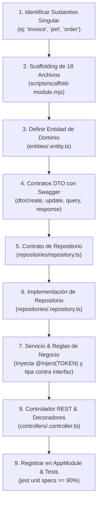

# 🏛️ NestJS Modular Monolith Architecture Standard

## 🎯 Propósito

Estandarizar el diseño, modularización y construcción de backends y microservicios en **NestJS** bajo el patrón de **Modular Monolith (Monolito Modular)** y principios de arquitectura limpia. Establece el aislamiento estricto de capacidades de dominio (`src/modules/<nouns>/`), contratos de entrada y salida obligatorios mediante DTOs, documentación Swagger OpenAPI exhaustiva, persistencia agnóstica a cualquier ORM/base de datos (TypeORM, Prisma, MikroORM, Drizzle, etc.) a través del patrón Repositorio y Entidades de dominio, y una doble barrera de seguridad con RBAC declarativo y validación de propiedad en servicios.

---

## ⚡ Cuándo Activar esta Skill

- Al crear o refactorizar un módulo de negocio dentro de `src/modules/<nouns>/`.
- Al generar el andamiaje completo de 18 archivos de un módulo (Entity, DTOs, Repository Contract & Impl, Service, Controller, Specs y Module).
- Al implementar controladores REST con documentación Swagger completa (`@ApiTags`, `@ApiOperation`, `@ApiOkResponse`, etc.).
- Al estructurar DTOs de validación con `class-validator` y `class-transformer` (`CreateDto`, `UpdateDto`, `QueryDto`, `ResponseDto`).
- Al diseñar repositorios con Inversión de Dependencias (contrato `repository.ts` e implementación `<noun>.repository.ts`).
- Al implementar autorización: Guards globales (`JwtAuthGuard`, `RolesGuard`) y verificación de propiedad (*ownership*) en el servicio.

---

## 📋 Flujo de Trabajo Paso a Paso



### Secuencia Obligatoria de Scaffolding (18 Archivos en Orden)
Cuando se crea un módulo para un sustantivo singular (`<noun>`), generar los archivos en este orden estricto:

1. `src/modules/<nouns>/entities/<noun>.entity.ts`: Clase con campos `readonly` y método estático `fromPersistence()`.
2. `src/modules/<nouns>/entities/index.ts`: Re-export de la entidad.
3. `src/modules/<nouns>/dto/create-<noun>.dto.ts`: Validación con `class-validator` y decoradores `@ApiProperty`.
4. `src/modules/<nouns>/dto/update-<noun>.dto.ts`: Extiende `PartialType(OmitType(Create<Noun>Dto, [] as const))`.
5. `src/modules/<nouns>/dto/find-<nouns>-query.dto.ts`: Paginación (`page`, `limit`) y filtros de búsqueda.
6. `src/modules/<nouns>/dto/<noun>-response.dto.ts`: Payload público de respuesta con `@ApiProperty`, `@Expose()` y `fromEntity()`.
7. `src/modules/<nouns>/dto/index.ts`: Re-export de todos los DTOs.
8. `src/modules/<nouns>/repositories/repository.ts`: **Contrato de Interfaz** (`I<Noun>Repository`) y Token de Inyección (`<NOUN>_REPOSITORY_TOKEN`).
9. `src/modules/<nouns>/repositories/<noun>.repository.ts`: **Implementación** (`<Noun>Repository implements I<Noun>Repository`).
10. `src/modules/<nouns>/repositories/<noun>.repository.spec.ts`: Tests unitarios mockeando el cliente de persistencia con `jest.fn()`.
11. `src/modules/<nouns>/repositories/index.ts`: Re-export de contrato e implementación.
12. `src/modules/<nouns>/services/<noun>.service.ts`: Inyecta `@Inject(<NOUN>_REPOSITORY_TOKEN) private readonly repo: I<Noun>Repository`.
13. `src/modules/<nouns>/services/<noun>.service.spec.ts`: Tests de todos los branches y excepciones.
14. `src/modules/<nouns>/services/index.ts`: Re-export del servicio.
15. `src/modules/<nouns>/controllers/<noun>.controller.ts`: Endpoints tipados estrictamente a Response DTOs con Swagger completo.
16. `src/modules/<nouns>/controllers/<noun>.controller.spec.ts`: Tests de delegación y mapeo de controladores.
17. `src/modules/<nouns>/controllers/index.ts`: Re-export del controlador.
18. `src/modules/<nouns>/<noun>.module.ts`: Declaración del `@Module` proveyendo `{ provide: <NOUN>_REPOSITORY_TOKEN, useClass: <Noun>Repository }`.

---

## ⚠️ Reglas Críticas

1. **Inversión de Dependencias en Repositorios (DIP)**:
   - Los servicios **NUNCA** se acoplan a la clase concreta de implementación del repositorio.
   - El contrato es una interfaz nombrada `I<Noun>Repository` en `repositories/repository.ts`.
   - La implementación es una clase nombrada `<Noun>Repository` en `repositories/<noun>.repository.ts` (`implements I<Noun>Repository`).
   - El servicio inyecta y hace referencia exclusivamente a la interfaz del contrato (`I<Noun>Repository`) mediante su token: `@Inject(<NOUN>_REPOSITORY_TOKEN) private readonly repo: I<Noun>Repository`.
   - La implementación concreta solo se vincula en el array de `providers` del módulo NestJS.
2. **Retorno Estricto de Response DTOs en Controladores**:
   - Todo endpoint del controlador **DEBE** retornar `<Noun>ResponseDto` o `<Noun>ResponseDto[]` (transformado con `fromEntity`).
   - **PROHIBIDO**: Retornar entidades de dominio, modelos de ORM o registros de base de datos directamente a los clientes API.
3. **Aislamiento Total del ORM / Base de Datos**:
   - Ningún ORM ni librería de base de datos se importa directamente en controladores ni servicios.
   - El Repositorio es la única capa que interactúa con el motor de persistencia y siempre debe retornar Domain Entities inmutables.
3. **Regla de Nombres: Carpeta Plural, Archivos Singulares**:
   - La carpeta del módulo es siempre **plural** en `kebab-case` (ej. `src/modules/pets/`, `src/modules/invoices/`). Excepción: `auth` se mantiene en singular.
4. **Regla de Barrels de Hoja Terminal (*Leaf-Folder Barrel Policy*)**:
   - La raíz del módulo `src/modules/<nouns>/` **NUNCA** lleva un archivo `index.ts` (es un contenedor que agrupa subcarpetas).
   - Las subcarpetas internas (`controllers/`, `dto/`, `entities/`, `repositories/`, `services/`) **SÍ** llevan `index.ts` porque contienen directamente archivos de implementación.
   - El consumo de servicios entre módulos se realiza inyectando el servicio provisto por el módulo exportador, importando desde la subcarpeta hoja: `import { UserService } from '@/modules/users/services';`.
5. **Doble Barrera de Autorización (RBAC + Ownership)**:
   - Los decoradores `@Roles(...)` en el controlador filtran el acceso a nivel de ruta HTTP.
   - La capa de servicio **DEBE** validar la propiedad del recurso (`requesterRole === Role.ADMIN` o `entity.ownerId === requesterId`), lanzando `ForbiddenException` si no coincide.
6. **Documentación Swagger Exhaustiva**:
   - Cada método del controlador debe incluir `@ApiOperation`, decoradores de respuesta (`@ApiOkResponse`, `@ApiCreatedResponse`), `@ApiParam` con formato UUID en rutas con ID, y respuestas de error (`@ApiUnauthorizedResponse`, `@ApiForbiddenResponse`).
7. **Exclusión de Pruebas Unitarias en `src/config/`**:
   - La carpeta `src/config/` (esquemas de validación de entorno Joi, loaders de configuración con `@nestjs/config` y constantes) contiene configuraciones estáticas declarativas del sistema y **NO** lleva pruebas unitarias directas (`*.spec.ts`).

---

## 📚 Referencias

- [Guía del Monolito Modular](references/modular-monolith-guide.md): Principios de diseño, encapsulación de dominio y comunicación inter-módulos.
- [Estándares de DTOs y Swagger OpenAPI](references/dto-and-swagger-standards.md): Matriz de uso de DTOs, checklist de Swagger y pipes de validación.
- [Patrón de Repositorios y Entidades de Dominio](references/repository-and-entity-pattern.md): Desacoplamiento de ORM, mappers `fromDB`, paginación transaccional y unit tests.
- [Estrategia de RBAC y Validación de Ownership](references/rbac-and-ownership.md): Coarse guards en controladores y validación granular de permisos en servicios.

---

## 🛠️ Scripts

La skill proporciona un script generador Node.js ESM para andamiar automáticamente los 18 archivos del módulo:

### Generar un Módulo NestJS Completo
```bash
node skills/architecture/nestjs-architecture/scripts/scaffold-module.mjs <noun-singular> [--target-dir <path>]
```
*Ejemplo:* `node skills/architecture/nestjs-architecture/scripts/scaffold-module.mjs invoice --target-dir src/modules`
