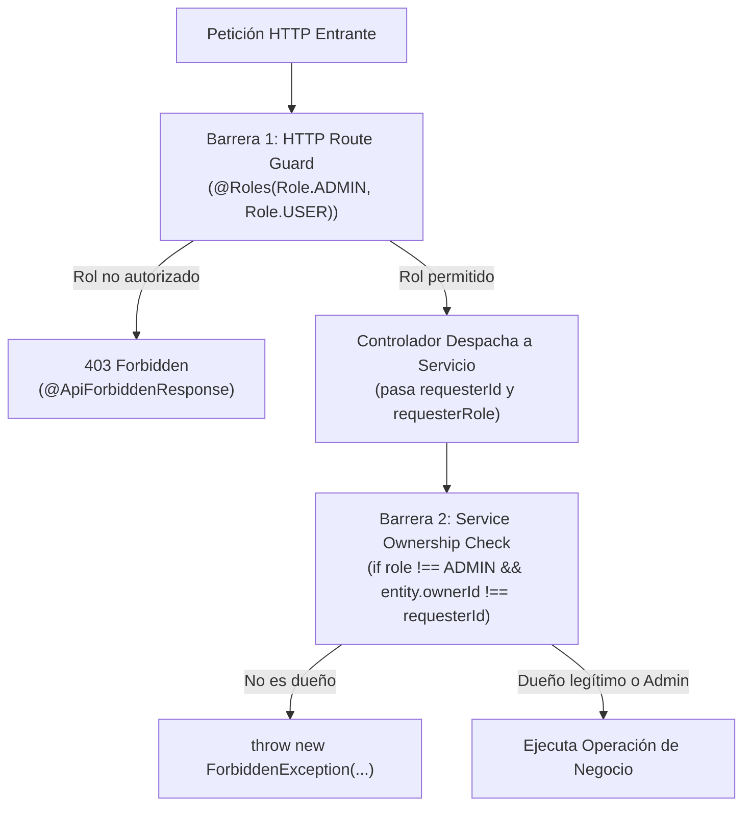

# Estrategia de RBAC y Validación de Ownership

Este documento establece la estrategia de seguridad de **doble barrera** en NestJS: control de acceso basado en roles (RBAC) en los controladores y validación granular de propiedad (*ownership*) en los servicios.

---

## 1. La Doble Barrera de Seguridad



1. **Barrera 1 (Perímetro HTTP)**:
   - Evaluada por `JwtAuthGuard` y `RolesGuard` de manera global.
   - El decorador `@Roles(Role.ADMIN, Role.USER)` define qué perfiles tienen permitido invocar el endpoint a nivel macro.
   - Si la ruta es abierta al público (ej. login o catálogo geográfico), se marca explícitamente con `@Public()`.
2. **Barrera 2 (Capa de Servicio de Dominio)**:
   - El controlador extrae el ID y rol del usuario autenticado (`req.user.id`, `req.user.role`) y los envía al servicio.
   - El servicio verifica la pertenencia del recurso: un usuario común solo puede ver o modificar recursos creados por él o asignados a su cuenta.
   - El rol `ADMIN` típicamente realiza bypass de las reglas de propiedad.

---

## 2. Firmas Estándar de Métodos de Servicio

Para soportar la auditoría y la validación de propiedad, todos los métodos del servicio deben mantener firmas consistentes:

```typescript
// services/<noun>.service.ts

create(dto: CreateNounDto, requesterId: string, requesterRole: Role): Promise<Noun>;

findAll(query: FindNounsQueryDto, requesterId: string, requesterRole: Role): Promise<PaginatedResult<Noun>>;

findOne(id: string, requesterId: string, requesterRole: Role): Promise<Noun>;

update(id: string, dto: UpdateNounDto, requesterId: string, requesterRole: Role): Promise<Noun>;

remove(id: string, requesterId: string, requesterRole: Role): Promise<void>;
```

---

## 3. Ejemplo de Implementación en Servicio

```typescript
import { Injectable, Inject, NotFoundException, ForbiddenException, BadRequestException } from '@nestjs/common';
import { IInvoiceRepository, INVOICE_REPOSITORY_TOKEN } from '../repositories';
import { Invoice } from '../entities';
import { CreateInvoiceDto, UpdateInvoiceDto, FindInvoicesQueryDto } from '../dto';

export enum Role {
  ADMIN = 'admin',
  STAFF = 'staff',
  CUSTOMER = 'customer',
}

@Injectable()
export class InvoiceService {
  constructor(
    @Inject(INVOICE_REPOSITORY_TOKEN)
    private readonly invoiceRepository: IInvoiceRepository // Inyección de contrato abstracto
  ) {}

  async findOne(id: string, requesterId: string, requesterRole: Role): Promise<Invoice> {
    const invoice = await this.invoiceRepository.findById(id);

    if (!invoice) {
      throw new NotFoundException('Factura no encontrada');
    }

    // Validación de propiedad: Solo ADMIN/STAFF pueden ver cualquier factura; CUSTOMER solo las suyas
    if (requesterRole === Role.CUSTOMER && invoice.customerId !== requesterId) {
      throw new ForbiddenException('No tienes permisos para consultar esta factura');
    }

    return invoice;
  }

  async update(
    id: string,
    dto: UpdateInvoiceDto,
    requesterId: string,
    requesterRole: Role
  ): Promise<Invoice> {
    const invoice = await this.findOne(id, requesterId, requesterRole);

    // Regla de negocio: Clientes no pueden modificar facturas emitidas
    if (requesterRole === Role.CUSTOMER) {
      throw new ForbiddenException('Los clientes no tienen autorización para modificar facturas');
    }

    return this.invoiceRepository.update(id, dto);
  }

  async remove(id: string, requesterId: string, requesterRole: Role): Promise<void> {
    const invoice = await this.findOne(id, requesterId, requesterRole);

    // Solo ADMIN puede eliminar facturas del sistema
    if (requesterRole !== Role.ADMIN) {
      throw new ForbiddenException('Solo los administradores pueden anular o eliminar registros contables');
    }

    await this.invoiceRepository.remove(id);
  }
}
```

---

## 4. Respuestas y Excepciones HTTP Estándar

| Excepción | Código HTTP | Mensaje Recomendado | Cuándo Lanzar |
| :--- | :---: | :--- | :--- |
| `NotFoundException` | `404` | `'<Recurso> no encontrado'` | Cuando el ID buscado no existe en la persistencia. |
| `ForbiddenException` | `403` | `'No tienes permisos suficientes para realizar esta acción'` | Cuando el rol o la propiedad (*ownership*) fallan. |
| `BadRequestException` | `400` | `'Operación inválida: <motivo específico>'` | Violación de regla de negocio o auto-eliminación prohibida. |
