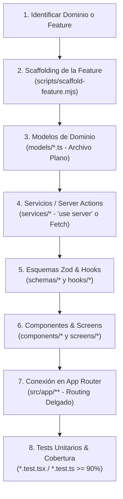

# ⚡ Next.js Screaming Architecture Standard

## 🎯 Propósito

Estandarizar el diseño, modularización y construcción de aplicaciones en **Next.js (App Router)** siguiendo los principios de **Screaming Architecture** (Feature-Driven / Domain-First). Garantiza código desacoplado, mantenible y predecible mediante encapsulación en subcarpetas, App Router delgado, separación estricta de responsabilidades (UI, hooks, servicios, esquemas y modelos) y tests unitarios con cobertura $\ge 90\%$.

---

## ⚡ Cuándo Activar esta Skill

- Al diseñar, crear o refactorizar módulos de negocio dentro de `src/features/<feature-name>/`.
- Al crear componentes UI compartidos (`src/components/common/`) o específicos de feature.
- Al implementar flujos de datos: **Server Actions** (`'use server'`) o **TanStack Query custom hooks**.
- Al construir modales de creación o edición siguiendo el estándar **FormDialog** (`*-form-dialog`).
- Al definir esquemas de validación Zod (`*.schema.ts`) o contratos de dominio (`models/*.ts`).
- Al validar convenciones de nombres, sufijos de archivo y prohibición de barrel files contenedores.

---

## 📋 Flujo de Trabajo Paso a Paso



### 1. Modelado de Dominio (`models/`)
Definir las interfaces, tipos y enums del dominio en archivos planos dentro de `src/features/<feature>/models/<entity>.ts` (o `src/models/` para modelos globales compartidos).
- **Regla**: Son archivos planos de TypeScript puro. Al contener archivos directamente sin subcarpetas, `models/` incluye su propio `index.ts` para reexportar sus contratos.

### 2. Servicios de Datos (`services/`)
Implementar la comunicación con APIs externas o base de datos:
- Encapsular cada servicio en su propia subcarpeta: `<verb>-<noun>/<verb>-<noun>.service.ts`.
- Declarar `'use server'` cuando actúe como Server Action de Next.js.
- Usar `fetch` nativo con políticas de revalidación explícitas (`cache: 'no-store'` o `next: { revalidate }`).

### 3. Esquemas de Validación (`schemas/`)
Definir validaciones de formularios y contratos en tiempo de ejecución con **Zod**:
- **Archivos planos**: Se definen directamente dentro de `schemas/<name>.schema.ts` (ej. `create-pet.schema.ts`).
- **Sin pruebas unitarias**: Al igual que `models/`, son declaraciones de esquemas puras y no llevan archivos `.test.ts`.
- **Barrel local**: Al ser una carpeta hoja con archivos directos, `schemas/index.ts` reexporta todos los esquemas de la feature.
- **Identificador**: Constante en `camelCase` terminada en `Schema` (ej. `createPetSchema`).

### 4. Orquestación de Estado y Consultas (`hooks/`)
Aislar la lógica de estado fuera de los componentes de UI:
- Subcarpeta: `hooks/use-<action>/use-<action>.hook.ts`.
- Para mutaciones con Server Actions: usar `useTransition` o `useActionState`.
- Para fetching y caché reactivo en cliente: usar **TanStack Query** (`useQuery` / `useMutation`) con key factories dedicadas.

### 5. Componentes y Pantallas (`components/`, `screens/`)
Construir los bloques de interfaz visual:
- Seguir el protocolo de 3 niveles: (1) Reutilizar de `src/components/`, (2) Añadir desde `shadcn/ui`, (3) Crear componente custom.
- Encapsular en subcarpeta con: implementación, test unitario adyacente y local barrel `index.ts`.
- Para modales de formularios: extender el estándar `FormDialog` en subcarpetas `*-form-dialog/`.
- Documentar todas las interfaces de props y componentes con **TSDoc**.

### 6. Integración en App Router (`src/app/`)
- Las páginas (`page.tsx`) y layouts (`layout.tsx`) deben ser ultra delgadas: importar y renderizar la screen correspondiente (`import { FeatureScreen } from '@/features/<feature>/screens/<feature>-screen'`), inyectar metadata y armar la composición visual.
- **Cero Pruebas Unitarias en `src/app/`**: No se colocan archivos `.test.tsx` dentro de `src/app/`. Si un layout o página requiere lógica (transformación de parámetros, verificación de acceso o ensamblado dinámico de metadatos), esta debe extraerse a funciones auxiliares dentro de `src/features/<feature-name>/utils/` donde sí se implementan las pruebas unitarias correspondientes.

---

## ⚠️ Reglas Críticas

1. **Regla de la Hoja Terminal para Barrels (*Leaf-Folder Barrel Policy*)**:
   - Una carpeta **SOLO** debe tener `index.ts` si contiene **directamente archivos de implementación** (carpeta hoja).
   - Si una carpeta agrupa **subcarpetas** (como la raíz de la feature `src/features/<feature>/`, agrupadores como `components/`, `hooks/`, `sections/`), **NUNCA** lleva `index.ts`.
   - Únicamente las subcarpetas finales (`components/invoice-card/`) o carpetas con archivos directos (`models/`, `schemas/`, `utils/`) tienen `index.ts`.
2. **Importaciones Directas a la Carpeta con `index.ts`**:
   - Importar siempre apuntando a la carpeta que posee el `index.ts`:
     ```typescript
     // ✅ CORRECTO: Importación desde la carpeta hoja que posee index.ts
     import { usePetSearch } from '@/features/pets/hooks/use-pet-search';
     import { InvoiceCard } from '@/features/pets/components/invoice-card';
     import { IPet } from '@/features/pets/models';
     import { createPetSchema } from '@/features/pets/schemas';
     import { parsePetFilters } from '@/features/pets/utils';

     // ❌ PROHIBIDO: Importar desde carpetas contenedoras padre
     import { usePetSearch, IPet } from '@/features/pets';
     import { InvoiceCard } from '@/features/pets/components';
     ```
3. **Encapsulación por Subcarpeta**:
   - Todo componente, hook, servicio o contexto debe tener su subcarpeta en `kebab-case` con su implementación, test unitario y `index.ts` local.
4. **Cobertura de Tests $\ge 90\%$ y Exclusiones**:
   - Todo componente, hook, servicio o función utilitaria debe contar con su correspondiente `.test.tsx` o `.test.ts` colocado adyacente al archivo de implementación.
   - **Exclusiones Explícitas de Pruebas Unitarias**:
     - **Modelos y Esquemas (`models/`, `schemas/`)**: Son contratos declarativos y tipos puros; no llevan archivos de prueba unitaria.
     - **Configuración Global (`src/config/`)**: Constantes estáticas, configuración de cliente y esquemas de variables de entorno; no lleva pruebas unitarias.
     - **App Router (`src/app/`)**: No alberga tests directos; la lógica de páginas o layouts se extrae obligatoriamente a `src/features/<feature-name>/utils/` con sus respectivos tests.

---

## 📚 Referencias

- [Guía Detallada de Screaming Architecture](references/screaming-architecture-guide.md): Estructura exhaustiva de directorios, capas, sufijos y convenciones de nombres.
- [Patrones de Componentes y FormDialog](references/component-and-dialog-patterns.md): Protocolo de descubrimiento en 3 niveles, contenedor `FormDialog` y TSDoc.
- [Patrones de Datos: Server Actions & TanStack Query](references/tanstack-and-actions-pattern.md): Guía de selección y snippets de Server Actions y React Query hooks.

---

## 🛠️ Scripts

La skill incluye scripts de Node.js ESM para acelerar el andamiaje del proyecto:

### 1. Generar una Feature Completa
```bash
node skills/architecture/nextjs-architecture/scripts/scaffold-feature.mjs <feature-name> [--target-dir <path>]
```
*Ejemplo:* `node skills/architecture/nextjs-architecture/scripts/scaffold-feature.mjs billing --target-dir src/features`

### 2. Generar un Componente Encapsulado
```bash
node skills/architecture/nextjs-architecture/scripts/scaffold-component.mjs <component-name> [--target-dir <path>] [--type default|dialog|section]
```
*Ejemplo:* `node skills/architecture/nextjs-architecture/scripts/scaffold-component.mjs user-card --target-dir src/components/common`
