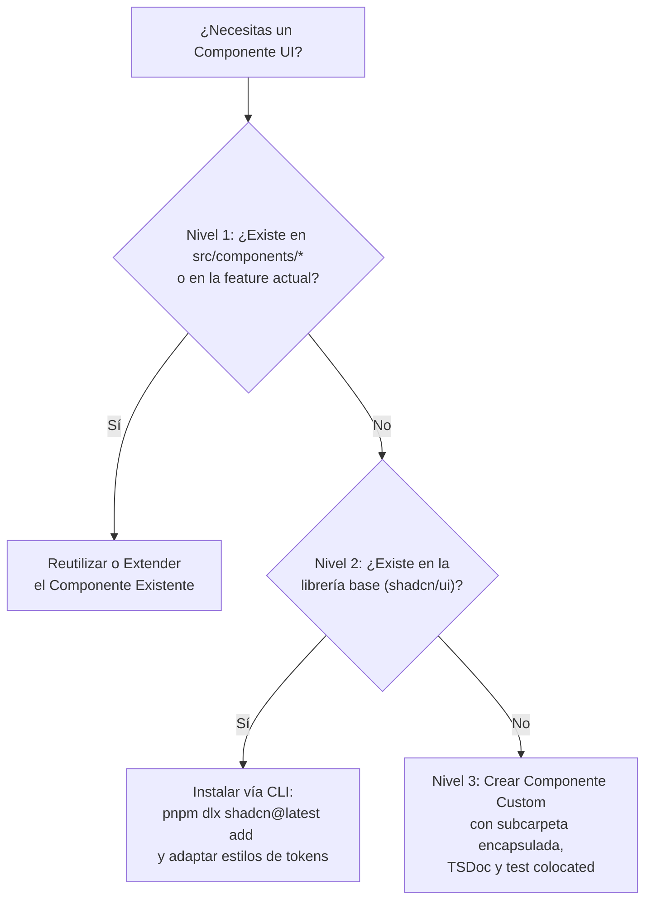

# Patrones de Componentes, FormDialog y Documentación TSDoc

Este documento define el ciclo de vida, descubrimiento, modularización y documentación de componentes de UI en Next.js.

---

## 1. Protocolo de Descubrimiento de Componentes (3-Tier Sequence)

Antes de crear cualquier componente visual (sea compartido o específico de una feature), el desarrollador o agente debe seguir rigurosamente esta secuencia de validación en 3 niveles:



1. **Nivel 1 — Comprobar componentes existentes**:
   - Revisar `src/components/ui/` (primitivas base), `src/components/common/` (compuestos reutilizables) o los componentes dentro de la feature actual (`src/features/<feature>/components/`).
   - Si existe, se reutiliza o parametriza con props opcionales.
2. **Nivel 2 — Instalar desde el registro base (`shadcn/ui`)**:
   - Si no existe en el proyecto, validar si está disponible en `shadcn/ui` (ej. `dialog`, `badge`, `table`, `sheet`, `popover`).
   - Instalar mediante `pnpm dlx shadcn@latest add <component>` y adaptar variantes y tokens de color al diseño de la aplicación.
3. **Nivel 3 — Construir Componente Custom**:
   - Solo si no existe ni localmente ni en el registro base, se genera un nuevo componente respetando el estándar de subcarpeta (`<name>/<name>.tsx`, `<name>/<name>.test.tsx`, `<name>/index.ts`), interfaces documentadas y estilos semánticos.

---

## 2. Arquitectura de Diálogos Modales: Estándar `FormDialog`

Todos los formularios modales de creación, edición, confirmación o envío de entidades deben estructurarse bajo el patrón **FormDialog**.

### 2.1 Contenedor Base Reutilizable (`src/components/common/form-dialog/`)
El contenedor `FormDialog` envuelve la primitiva modal de la aplicación (`Dialog` de `shadcn/ui`) y expone:
- Soporte para estado controlado (`open`, `onOpenChange`) y no controlado.
- Encabezado con título descriptivo, subtítulo/descripción e icono opcional (`icon?: React.ReactNode`).
- Viewport scrollable y responsivo con altura máxima controlada (`max-h-[90vh] overflow-y-auto`).
- Renderizado de disparador condicional (`trigger?: React.ReactNode | null`). Cuando se gestiona externamente desde tablas o botones padre, se pasa `trigger={null}`.

### 2.2 Subcarpeta de Entidad `*-form-dialog`
Cada formulario modal de entidad reside en su subcarpeta dedicada terminada en `-form-dialog` dentro de la feature:

```text
src/features/billing/components/invoice-form-dialog/
├── index.ts
├── invoice-form-dialog.test.tsx
└── invoice-form-dialog.tsx
```

### 2.3 Reglas del Patrón `*-form-dialog`:
1. **Interface de Props**: Nombrada como `I<Entity>FormDialogProps`:
   ```tsx
   export interface IInvoiceFormDialogProps {
     /** Controla la visibilidad del modal en modo controlado. */
     readonly open?: boolean;
     /** Callback ejecutado al cambiar el estado de apertura. */
     readonly onOpenChange?: (open: boolean) => void;
     /** Entidad opcional para modo edición. Si es null/undefined, opera en modo creación. */
     readonly initialData?: IInvoice | null;
     /** Callback al completar exitosamente la operación. */
     readonly onSuccess?: () => void;
   }
   ```
2. **Desacoplamiento con Custom Hook**: La lógica del formulario (validación con Zod, estado reactivo, llamada al servicio y toasts) se extrae a un hook adyacente (`use-invoice-form.hook.ts`).
3. **Subformularios Presentacionales**: Si el formulario es extenso o tiene múltiples pasos, el diálogo delega la vista a un componente de formulario puro (`invoice-form.tsx`), manteniendo el diálogo enfocado en el ciclo de vida del modal.

---

## 3. Estándar de Documentación TSDoc

Todos los componentes exportados en `src/components/common/` y `src/features/**/components/` (incluidas pantallas y secciones) deben incluir bloques **TSDoc** rigurosos.

### Plantilla de Documentación:

```tsx
import React from 'react';

/**
 * Propiedades para {@link MetricCard}.
 */
export interface IMetricCardProps {
  /** Título principal de la tarjeta de métricas. */
  readonly title: string;
  /** Valor numérico o texto representativo de la métrica. */
  readonly value: string | number;
  /** Porcentaje de cambio respecto al período anterior. */
  readonly trendPercentage?: number;
  /** Icono visual representativo. */
  readonly icon?: React.ReactNode;
  /** Callback opcional al interactuar con la tarjeta. */
  readonly onClick?: () => void;
}

/**
 * Renderiza una tarjeta de resumen métrico con indicador de tendencia e icono.
 *
 * @param props - Opciones de configuración descritas en {@link IMetricCardProps}.
 * @returns Elemento JSX renderizado.
 *
 * @example
 * ```tsx
 * import { MetricCard } from '@/components/common/metric-card';
 *
 * export function Example() {
 *   return (
 *     <MetricCard
 *       title="Facturación Mensual"
 *       value="$12,450"
 *       trendPercentage={8.4}
 *     />
 *   );
 * }
 * ```
 */
export function MetricCard({
  title,
  value,
  trendPercentage,
  icon,
  onClick,
}: Readonly<IMetricCardProps>): React.JSX.Element {
  return (
    <div
      role="button"
      tabIndex={onClick ? 0 : undefined}
      onClick={onClick}
      className="p-4 rounded-xl border bg-card text-card-foreground shadow-sm"
    >
      <div className="flex items-center justify-between">
        <span className="text-sm font-medium text-muted-foreground">{title}</span>
        {icon && <div className="text-muted-foreground">{icon}</div>}
      </div>
      <div className="mt-2 text-2xl font-bold">{value}</div>
      {trendPercentage !== undefined && (
        <p className="mt-1 text-xs text-muted-foreground">
          {trendPercentage >= 0 ? `+${trendPercentage}%` : `${trendPercentage}%`} vs mes anterior
        </p>
      )}
    </div>
  );
}
```
