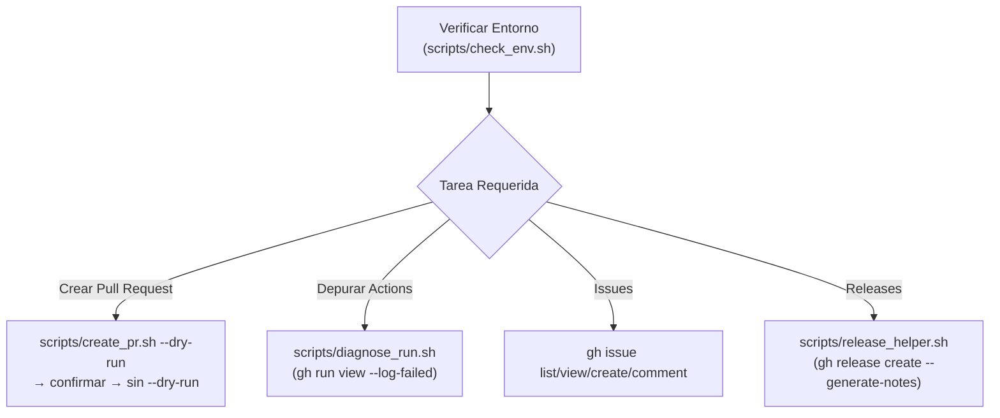

# 🐙 GitHub CLI (`gh`) Workflow & Automation

## 🎯 Propósito
Guiar al asistente en la gestión de repositorios de **GitHub** con `gh` CLI y scripts auxiliares. Estandariza la creación de **Pull Requests** (Conventional Commits, emoji por tipo, scope solo con issue, labels que ya existen en el repo), el diagnóstico de **GitHub Actions** fallidos, el trabajo con issues y la publicación de releases con notas generadas por GitHub.

## ⚡ Cuándo Activar esta Skill
- Al trabajar en repositorios alojados en GitHub (`github.com` o GitHub Enterprise).
- Al crear, revisar, aprobar o fusionar Pull Requests (`gh pr` o `scripts/create_pr.sh`).
- Al diagnosticar workflows o checks fallidos de GitHub Actions (`gh run`, `gh pr checks` o `scripts/diagnose_run.sh`).
- Al crear, listar o comentar issues, o al publicar releases y tags.
- No aplica a repositorios de GitLab: usa la skill `glab-cli`.

## 📋 Flujo de Trabajo Paso a Paso



1. **Paso 1: Verificación de Estado y Autenticación**:
   ```bash
   bash <skill-dir>/scripts/check_env.sh
   ```
   Si falla la autenticación, pide al usuario que ejecute `gh auth login`; nunca pidas ni escribas tokens.

2. **Paso 2: Creación Estandarizada de Pull Requests**:
   - Previsualiza siempre primero y muestra al usuario título, labels y rama base:
     ```bash
     # Issue detectado de la rama (feat/42-login-form) o explícito:
     bash <skill-dir>/scripts/create_pr.sh --issue 42 --domain auth --dry-run

     # Sin issue (título sin scope: <type>: <emoji> <desc>):
     bash <skill-dir>/scripts/create_pr.sh --dry-run
     ```
   - Tras la confirmación, repite el comando sin `--dry-run`. Añade `--push` solo si la rama no está publicada y el usuario lo aprueba; `--draft` si el trabajo no está listo.
   - Alternativa manual: `gh pr create --title "<título>" --body "<cuerpo>" --base main`.

3. **Paso 3: Revisión y Fusión de PRs**:
   ```bash
   gh pr view <n> --comments        # contexto y conversación
   gh pr diff <n>                   # cambios
   gh pr checks <n>                 # estado de CI
   gh pr review <n> --approve       # o --request-changes --body "..."
   gh pr merge <n> --squash --delete-branch   # solo con aprobación explícita del usuario
   ```

4. **Paso 4: Diagnóstico de GitHub Actions**:
   ```bash
   # Último run fallido de la rama actual, solo logs de pasos fallidos:
   bash <skill-dir>/scripts/diagnose_run.sh

   # Checks de un PR y logs de un job concreto:
   bash <skill-dir>/scripts/diagnose_run.sh --pr 57 --job lint --lines 50
   ```
   Lee el log, identifica la causa y corrige el código. Reintenta (`gh run rerun <id> --failed`) solo si el fallo es transitorio (red, runner caído).

5. **Paso 5: Issues y Releases**:
   ```bash
   gh issue list --assignee @me --state open
   gh issue view 42 --comments
   bash <skill-dir>/scripts/release_helper.sh draft-notes
   bash <skill-dir>/scripts/release_helper.sh create v1.4.0 --dry-run
   ```

## 🛠️ Scripts y Herramientas Auxiliares

> **Rutas:** `<skill-dir>` es el directorio que contiene este `SKILL.md` (p. ej. `.claude/skills/<name>/` o `.agents/skills/<name>/`). Ejecuta los scripts desde la raíz del proyecto del usuario, no desde `<skill-dir>`.

- [`scripts/check_env.sh`](scripts/check_env.sh): Valida `git`, `gh`, la sesión activa y el repositorio de GitHub detrás de `origin`.
- [`scripts/create_pr.sh`](scripts/create_pr.sh): Crea el PR con:
  - Título con issue: `<type>(#<issue-id>): <emoji> <description>`; sin issue: `<type>: <emoji> <description>`.
  - Label de tipo con los labels por defecto de GitHub (`enhancement`, `bug`, `documentation`) y `domain: <nombre>` opcional.
  - Dominios permitidos: si existe `.gh-domains` en la raíz del repo (uno por línea), `--domain` debe estar en esa lista.
  - Verificación previa de que todos los labels existen, de que no hay ya un PR abierto para la rama y de que la rama tiene upstream.
  - Cuerpo con `Closes #<id>`, resumen de commits y la plantilla `.github/pull_request_template.md` si existe.
- [`scripts/diagnose_run.sh`](scripts/diagnose_run.sh): Último run fallido de la rama o PR y logs de los pasos fallidos, filtrables por job.
- [`scripts/release_helper.sh`](scripts/release_helper.sh): `list`, `view`, `draft-notes` y `create <tag>` con validación SemVer y notas generadas por GitHub.

## ⚠️ Reglas Críticas

1. **Regla de Título y Scope del PR**:
   - Con issue: `<type>(#<issue-id>): <emoji> <description>` (ej. `feat(#42): ✨ login form`).
   - Sin issue: `<type>: <emoji> <description>` (ej. `chore: 🔧 upgrade dependencies`).
   - **NUNCA** usar carpetas, paquetes ni apps como scope (`feat(web): ...` está PROHIBIDO).
2. **Labels existentes, nunca inventados**:
   - Usa solo labels que ya existen en el repositorio (`gh label list`). No ejecutes `gh label create` sin permiso explícito del usuario.
   - Los dominios válidos son los de `.gh-domains`; nunca inventes uno.
3. **Acciones con efectos externos requieren confirmación**:
   - Crear o fusionar PRs, aprobar, cerrar issues, publicar releases, relanzar workflows o hacer push: muestra primero lo que se hará (`--dry-run`) y espera confirmación.
   - **PROHIBIDO** `git push --force` hacia ramas compartidas, `gh pr merge --admin` para saltarse protecciones y `gh repo delete`.
4. **No interactividad**: Pasa siempre `--title`/`--body` (o `--fill`) y flags explícitos; nunca dejes `gh` esperando un prompt.
5. **Credenciales**: Nunca imprimas, pidas ni guardes tokens (`GH_TOKEN`, `gh auth token`). La autenticación la hace el usuario con `gh auth login`.
6. **Salida estructurada**: Para leer datos usa `--json <campos> --jq <filtro>` en lugar de parsear texto formateado.

## 📚 Referencias Adicionales

* [Estándares de GitHub: títulos, emojis, labels y cuerpo del PR](references/github_standards.md)
* [CheatSheet de comandos gh](references/commands_cheatsheet.md)
* [GitHub Actions y resolución de problemas](references/actions_and_troubleshooting.md)
* [Ejemplos de flujos de trabajo](examples/workflows.md)
