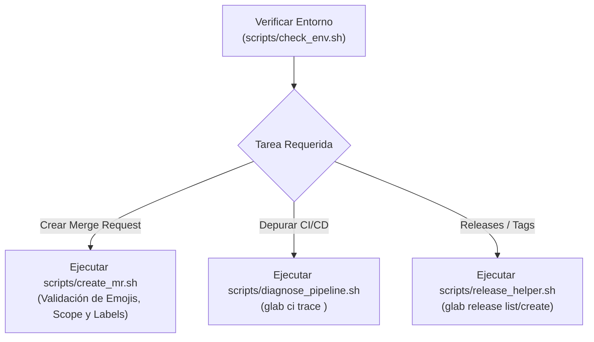

# 🦊 GitLab CLI (`glab`) Workflow & Automation

## 🎯 Propósito
Guiar al asistente y desarrollador en la gestión y automatización de repositorios en **GitLab** utilizando `glab` CLI y scripts auxiliares. Estandariza la creación de **Merge Requests (MRs)** siguiendo las normas estrictas del equipo (Conventional Commits, mapeo de emojis, Scoped Labels y ausencia de scope cuando no hay issue), diagnóstico rápido de pipelines fallidos y gestión de releases.

## ⚡ Cuándo Activar esta Skill
- Al trabajar en proyectos alojados en GitLab (`gitlab.com`, GitLab Self-Managed o Dedicated).
- Al crear, revisar, aprobar o gestionar Merge Requests (`glab mr` o `scripts/create_mr.sh`).
- Al diagnosticar jobs fallidos de CI/CD o ver logs de pipelines (`scripts/diagnose_pipeline.sh` o `glab ci`).
- Al validar entorno de autenticación, variables o releases de GitLab.

## 📋 Flujo de Trabajo Paso a Paso



1. **Paso 1: Verificación de Estado y Autenticación**:
   - Ejecutar el script de comprobación previa:
     ```bash
     ./skills/gitlab/glab-cli/scripts/check_env.sh
     ```

2. **Paso 2: Creación Estandarizada de Merge Requests**:
   - Usar el script asistente para generar el MR con el título, emojis, labels y formato exacto:
     ```bash
     # Con Issue ID detectado o explícito:
     ./skills/gitlab/glab-cli/scripts/create_mr.sh --issue 42 --domain pets

     # Sin Issue ID (genera título sin scope: <type>: <emoji> <desc>):
     ./skills/gitlab/glab-cli/scripts/create_mr.sh --domain operations
     ```
   - O manualmente con `glab mr create`:
     ```bash
     glab mr create --fill --remove-source-branch --yes
     ```

3. **Paso 3: Diagnóstico y Monitoreo de Pipelines de CI/CD**:
   - Inspeccionar el pipeline de la rama activa y jobs fallidos:
     ```bash
     ./skills/gitlab/glab-cli/scripts/diagnose_pipeline.sh
     ```
   - Ver logs del job específico (ej. `lint`, `test:unit`, `build:app`):
     ```bash
     ./skills/gitlab/glab-cli/scripts/diagnose_pipeline.sh --job lint --lines 50
     ```

4. **Paso 4: Gestión de Releases y Notas de Versión**:
   - Listar o crear releases:
     ```bash
     ./skills/gitlab/glab-cli/scripts/release_helper.sh list
     ./skills/gitlab/glab-cli/scripts/release_helper.sh draft-notes
     ```

## 🛠️ Scripts y Herramientas Auxiliares

- [`scripts/check_env.sh`](file:///Users/brayansanjuan/Development/personal/agent-skills/skills/gitlab/glab-cli/scripts/check_env.sh): Valida `git`, `glab` y sesión activa.
- [`scripts/create_mr.sh`](file:///Users/brayansanjuan/Development/personal/agent-skills/skills/gitlab/glab-cli/scripts/create_mr.sh): Creación automatizada de MR con validación de:
  - Formato con issue: `<type>(#<issue-id>): <emoji> <description>`
  - Formato sin issue: `<type>: <emoji> <description>` (sin scope)
  - Scoped Labels obligatorios (`type::*`, `layer::*`, `domain::*`, `priority::*`).
- [`scripts/diagnose_pipeline.sh`](file:///Users/brayansanjuan/Development/personal/agent-skills/skills/gitlab/glab-cli/scripts/diagnose_pipeline.sh): Inspección de jobs y logs de CI.
- [`scripts/release_helper.sh`](file:///Users/brayansanjuan/Development/personal/agent-skills/skills/gitlab/glab-cli/scripts/release_helper.sh): Consulta y generación de releases.

## ⚠️ Reglas Críticas

1. **Regla de Título y Scope de MR**:
   - Si **hay Issue ID**: `<type>(#<issue-id>): <emoji> <description>` (ej. `feat(#42): ✨ pet registration`).
   - Si **NO hay Issue ID**: `<type>: <emoji> <description>` (ej. `chore: 🔧 upgrade dependencies`).
   - **NUNCA usar carpetas ni paths como scope** (ej. `feat(web): ...` está PROHIBIDO).
2. **Uso Exclusivo de Scoped Labels de Grupo**:
   - Solo usar labels de grupo (`type::feature`, `layer::frontend`, `domain::pets`, etc.). Nunca crear labels locales de repo.
3. **No interactividad en scripts**: Usar siempre `--yes` o flags no interactivas.

## 📚 Referencias Adicionales

* [Estándares de GitLab, Emojis y Scoped Labels](file:///Users/brayansanjuan/Development/personal/agent-skills/skills/gitlab/glab-cli/references/gitlab_standards.md)
* [CheatSheet Completo de Comandos glab](file:///Users/brayansanjuan/Development/personal/agent-skills/skills/gitlab/glab-cli/references/commands_cheatsheet.md)
* [Guía de CI/CD y Resolución de Problemas](file:///Users/brayansanjuan/Development/personal/agent-skills/skills/gitlab/glab-cli/references/ci_and_troubleshooting.md)
* [Ejemplos de Flujos de Trabajo](file:///Users/brayansanjuan/Development/personal/agent-skills/skills/gitlab/glab-cli/examples/workflows.md)
