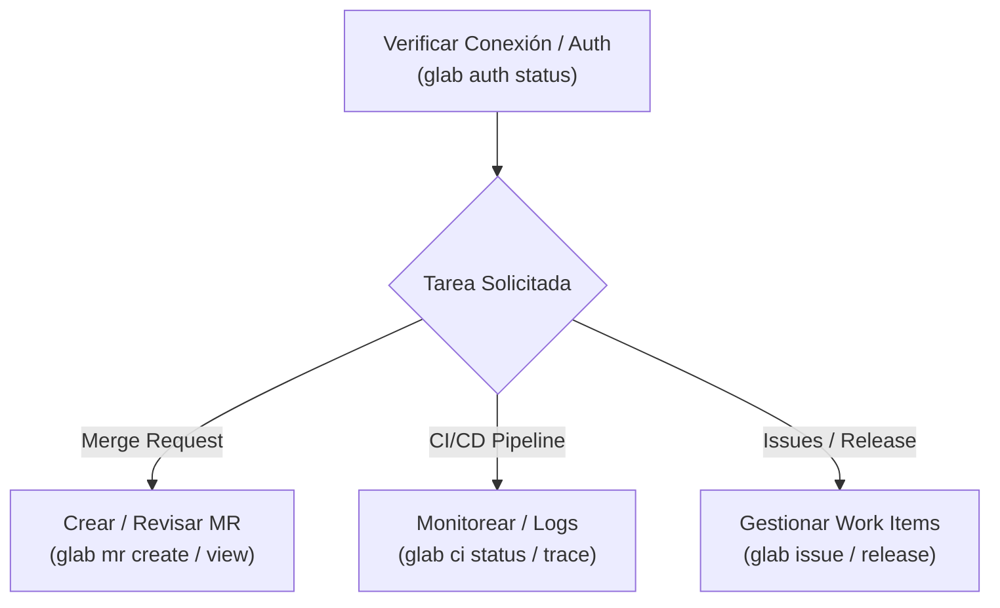

# 🦊 GitLab CLI (`glab`) Workflow & Automation

## 🎯 Propósito
Guiar al asistente y desarrollador en el uso eficiente y automatizado de la herramienta oficial **GitLab CLI (`glab`)** para gestionar repositorios, crear y revisar Merge Requests (MRs), monitorear y reintentar pipelines de CI/CD, gestionar issues y consultar la API de GitLab directamente desde la terminal.

## ⚡ Cuándo Activar esta Skill
- Al trabajar en proyectos alojados en GitLab (`gitlab.com`, GitLab Self-Managed o Dedicated).
- Al crear, revisar, aprobar o fusionar Merge Requests (`glab mr`).
- Al monitorear el estado de pipelines, depurar logs de jobs fallidos o validar `.gitlab-ci.yml` (`glab ci`).
- Al gestionar variables de entorno, releases o issues del proyecto.

## 📋 Flujo de Trabajo Paso a Paso



1. **Paso 1: Verificación de Estado y Autenticación**:
   - Comprobar que `glab` esté autenticado y reconozca el repositorio remoto:
     ```bash
     glab auth status
     ```
   - Si no está autenticado, utilizar `GITLAB_TOKEN` o iniciar sesión con `glab auth login`.

2. **Paso 2: Gestión de Merge Requests (MRs)**:
   - Para crear un MR a partir de los cambios locales y la rama actual:
     ```bash
     glab mr create --fill --remove-source-branch --yes
     ```
   - Para listar o inspeccionar un MR existente:
     ```bash
     glab mr list
     glab mr view <id>
     ```
   - Para revisar diff o aprobar:
     ```bash
     glab mr diff <id>
     glab mr approve <id>
     ```

3. **Paso 3: Diagnóstico y Monitoreo de CI/CD**:
   - Comprobar el estado del pipeline en ejecución:
     ```bash
     glab ci status
     ```
   - Si un job falla, inspeccionar la traza de logs para diagnosticar la causa raíz:
     ```bash
     glab ci trace <nombre-del-job>
     ```
   - Para reintentar jobs tras corregir incidencias:
     ```bash
     glab ci retry
     ```
   - Para validar la sintaxis del archivo de CI antes de hacer push:
     ```bash
     glab ci lint .gitlab-ci.yml
     ```

4. **Paso 4: Automatización Avanzada y API**:
   - Para operaciones personalizadas, consultar la API REST directamente con `glab api`:
     ```bash
     glab api "projects/:id/repository/commits"
     ```

## ⚠️ Reglas Críticas
- **No interactividad en scripts**: Usar siempre flags como `--yes`, `--fill` o `-y` al ejecutar comandos en flujos automatizados para evitar que la CLI se quede esperando prompts interactivos.
- **Instancias Self-Managed**: Asegurar que la variable `GITLAB_HOST` esté configurada adecuadamente si el repositorio no reside en `gitlab.com`.
- **Seguridad**: Nunca exponer tokens personales (`glpat-*`) en logs públicos o commits.

## 📚 Referencias
* [CheatSheet Completo de Comandos](file:///Users/brayansanjuan/Development/personal/agent-skills/skills/gitlab/glab-cli/references/commands_cheatsheet.md)
* [Guía de CI/CD y Resolución de Problemas](file:///Users/brayansanjuan/Development/personal/agent-skills/skills/gitlab/glab-cli/references/ci_and_troubleshooting.md)
